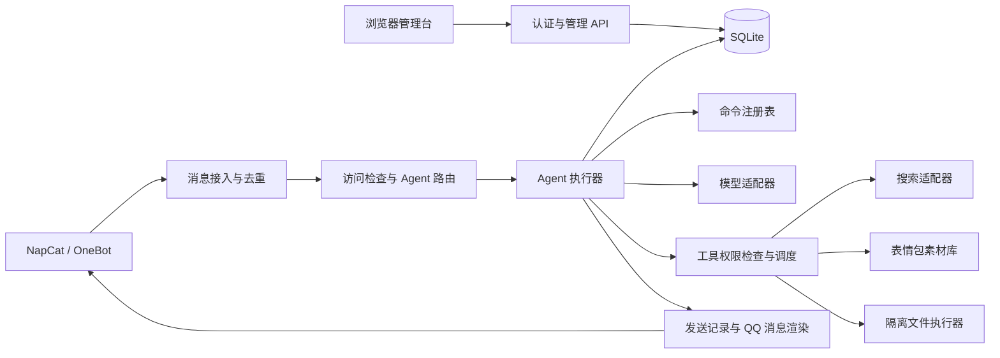

# Agent 管理台设计方案

状态：设计已落地实现（分支 codex/agent-management），自动化测试通过；真实环境验收待执行。范围：现有 Ubuntu / Docker / NapCat 项目，先管理当前登录的 QQ 账号。

配套材料：[实现方案设计](./agent-management-implementation.md)、[实施任务计划](../superpowers/plans/2026-09-29-agent-management.md)。

## 1. 目标与设计选择

把目前由 `.env` 驱动的单 Agent 聊天程序，升级为可在浏览器管理的多 Agent 系统，覆盖：

1. Agent 增删改查、详情页、角色 Prompt、模型与加密凭据。
2. 可配置命令和预定义操作。
3. QQ 群与好友访问控制、触发规则、Agent 绑定。
4. 持久化会话记录、分层执行权限、白名单文件操作。
5. 联网搜索、表情包、可扩展的 0–1 对话风格参数。
6. 可配置回复节奏，控制生成完成后的发送等待时间。

建议采用“一个管理与聊天应用 + SQLite + 隔离文件执行器”。保留 NapCat。

| 方案                                | 成本与限制                                               | 结论                   |
| ----------------------------------- | -------------------------------------------------------- | ---------------------- |
| 给 `.env` 增加表单                  | 开发少，但难以实现多 Agent、历史记录、发布版本和权限审计 | 不适合作为本次完整方案 |
| 模块化应用 + SQLite + 文件执行器    | 适合当前单机 Docker，部署简单，核心数据有事务一致性      | 推荐                   |
| API、消息队列、数据库等全部独立部署 | 适合多租户和高并发，当前运维成本偏高                     | 暂不采用               |

第一版不实现多 QQ 同时登录、任意 Shell 执行、在线编辑 JavaScript 插件、自动通过好友申请。数据模型保留 `botAccountId`，后续增加账号连接器无需改变 Agent 和会话模型。

本方案将“白名单文件”理解为管理员明确授权的服务器文件或目录资源，不等同于 QQ 账号白名单配置文件。后者属于控制配置，默认禁止 Agent 修改。

## 2. 页面与交互

前端建议 React + TypeScript + Vite + Ant Design；后端沿用 Node.js，新增 Fastify API。构建后的页面由后端同源托管，浏览器不直接访问 NapCat 或模型服务。

左侧导航：概览、Agents、QQ 接入与权限、会话记录、对话设定、命令模板、工具与资源、模型与凭据、审计与系统设置。

页面采用中文管理台布局：左侧固定导航，顶部显示 QQ 在线状态与服务状态；列表支持搜索、筛选和分页，详情页使用标签页；危险或敏感状态同时使用文字标识，不能仅靠颜色区分。密钥列表不提供明文展开或复制功能。

### 2.1 概览

显示 QQ 在线状态、启用 Agent 数量、活跃会话数、当天模型调用和错误数、Token 用量、待审批文件变更。Token/费用只在模型返回 usage 或配置价格时展示，缺失显示未知。

### 2.2 Agent 列表

列：头像、名称、说明、启用状态、模型、权限等级、绑定数量、最近活动、已发布版本。

操作：新建、搜索、查看、编辑、复制、启用/停用、归档、删除。

- 新建默认使用 L0，只创建草稿。
- 复制 Agent 可以复用凭据引用，但不会展示或复制明文到浏览器。
- 被路由绑定的 Agent 不能直接删除，必须先解除或迁移绑定。
- 归档停止新请求，保留会话记录；彻底删除独立展示影响范围。
- 停用、撤权等控制变更立即阻止新工具调用和后续发送；其他配置修改通过发布生效。

### 2.3 Agent 详情

| 标签页     | 内容                                                                           |
| ---------- | ------------------------------------------------------------------------------ |
| 基础信息   | 名称、头像、描述、启用状态、标签                                               |
| 角色与对话 | 角色 Prompt、从设定库添加/新建设定、0–1 滑块、回复节奏、最终指令预览、版本差异 |
| 模型       | Provider、Base URL、模型名、凭据引用、超时、输出 Token 上限、兼容能力          |
| 命令       | 该 Agent 启用的命令、参数、所需权限、冷却和结果格式                            |
| 工具与权限 | L0–L3、允许工具、搜索策略、文件资源引用                                        |
| QQ 绑定    | 绑定的群、好友和群内用户覆盖规则                                               |
| 会话       | 按账号和时间过滤该 Agent 的历史                                                |
| 调试与版本 | 沙盒对话、调用轨迹、草稿发布、历史版本与回滚                                   |

编辑后先保存草稿，点击“发布”原子更新运行配置。当前请求绑定一个不可变版本，下一条消息使用新版本；每次工具执行仍检查最新权限，防止发布期间撤权失效。

沙盒默认使用假工具和独立会话，不向 QQ 发消息，也不写真实文件。用户明确切换到真实模型测试后才消耗模型额度；真实工具测试受同样权限约束。

### 2.4 QQ 接入与权限

显示当前登录 QQ 身份、连接状态及 NapCat 管理入口。第一版继续在 NapCat WebUI 完成扫码，不在管理台重新实现 QQ 登录。

页面分三个区域：

- 群聊：群号、群名缓存、是否允许、默认 Agent、触发方式、是否引用回复、会话权限上限。
- 好友私聊：好友 QQ、备注、是否允许、绑定 Agent、权限上限。仍需是好友会话；不自动添加好友。
- 群内用户覆盖：在指定群中，为某个 QQ 用户覆盖默认 Agent 或授权；不能绕过该群的禁用状态。

允许与绑定使用不同字段：绑定 Agent 不等于获得访问权限。空白名单表示不允许任何人，不解释为全部放行。

提供“路由预览”：输入群号、用户 QQ 和示例消息，显示是否允许、触发哪条规则、使用哪个 Agent、最终工具能力以及拒绝原因。预览不调用模型。

### 2.5 会话记录

使用三栏布局：账号/群与筛选器、会话列表、消息时间线。可按 Agent、机器人账号、群号、用户 QQ、时间范围和调用状态查询。

详情包括用户消息、机器人回答、使用的 Agent 版本、模型、搜索来源、工具状态、耗时、发送成功/失败/未知。不展示模型隐藏推理，不保存密钥到调用轨迹。

操作：清除后续上下文、删除历史、导出授权范围内的记录、查看审计。“清除上下文”与“删除记录”是两个明确区分的操作。

## 3. 系统结构



内部模块提供少量稳定接口：

- `AgentRegistry.resolve(binding)`：取已发布 Agent 配置快照，不返回明文密钥给调用页面。
- `PolicyEngine.authorize(context, operation, resource)`：统一检查访问、工具和资源权限。
- `ConversationStore.begin/append/reset`：会话、消息、上下文边界与执行状态。
- `AgentRuntime.run(turn)`：编排命令、模型和工具，返回结构化回复及执行状态。
- `ToolExecutor.execute(request)`：接收经过校验的工具名和参数，再次做授权与限额检查。
- `SecretStore.use(secretRef, consumer)`：后端按需解密，调用方仅限受信模块。

保留现有 QQ WebSocket 鉴权、登录身份校验、重连和连接代次校验。模型服务、搜索和文件能力不写进 QQ 协议层。

现有文件的调整位置：

| 现有位置                           | 设计中的职责变化                                                                                              |
| ---------------------------------- | ------------------------------------------------------------------------------------------------------------- |
| `src/platforms/onebot/messages.js` | 把结构校验与真实 @ 检测保留为协议解析；白名单和触发决策移交路由模块，不能在解析阶段提前丢弃合法的短语触发消息 |
| `src/platforms/onebot/agent.js`    | 从固定单核心改为按消息调用 Agent 执行器；保持原连接代次约束                                                   |
| `src/chat/core.js`                 | 把会话存取抽到 ConversationStore，命令交给注册表，保留并发/冷却等执行限制                                     |
| `src/chat/provider.js`             | 按 Provider 和模型选择配置，增加工具能力检测与结构化调用结果                                                  |
| `src/platforms/onebot/config.js`   | 继续支持旧 CLI；管理模式只读取基础设施配置，业务配置来自数据库                                                |

回复从单个字符串演进为受校验的 `Reply { text, assetIds, sourceLinks }`，工具执行结果单独记录；QQ 渲染器负责生成文本/图片消息段。模型无权直接构造任意 OneBot API 调用。

## 4. 路由、触发与上下文

消息处理顺序固定为：

1. 校验机器人身份、消息类型、自身消息过滤和去重。
2. 检查群或好友白名单；拒绝消息不进入模型，也不保存完整正文。
3. 检查触发条件。
4. 解析 Agent 绑定与发言人权限。
5. 建立会话并写入用户消息。
6. 精确匹配命令；否则执行普通聊天和允许的工具。
7. 校验输出、写入发送任务、通过原连接发送、记录结果。

Agent 选择优先级：

| 场景 | 优先级                                                       |
| ---- | ------------------------------------------------------------ |
| 群聊 | 当前群内用户绑定 > 当前群默认 Agent > 当前 QQ 账号默认 Agent |
| 私聊 | 当前好友绑定 > 当前 QQ 账号默认 Agent                        |

默认 Agent 只作为已获准访问后的兜底，不扩大白名单。相同作用域的重复绑定不允许发布；绑定的 Agent 已停用时提示不可用，不偷偷换成其他角色。

群触发支持真实 @、消息开头的名称/短语、精确短语；可配置“任一满足”或“同时满足”。前缀要求边界，例如 `小助手 帮我…`，避免一句话里偶然出现角色名字就触发。第一版不开放任意正则或自动回复全部群消息。命令也要经过群触发检查，不能绕过白名单。

私聊默认直接触发，可设固定前缀。群与私聊均保持默认不引用原消息，可按群覆盖。

新会话标识：`平台 + botAccountId + 群/私聊 + peerId + senderId + agentId + contextEpoch`。

- 同一人在不同群、群与私聊、不同 Agent 之间完全隔离。
- 群内仍按发言人区分，不默认共享整个群的历史。
- 发布新角色版本默认开启新的上下文段，旧记录保留可查，避免旧角色影响新角色。
- `/reset` 增加当前会话的上下文代次；不会删除审计记录或别人的会话。
- 一轮模型请求绑定配置版本和上下文代次；重置、停用或撤权后，旧任务不得继续写文件或发送过期回答。

## 5. 命令系统

将目前写死的 `/help`、`/reset` 从聊天核心移到命令注册表。管理台可以创建、编辑、停用命令，命令名和别名按 Agent 唯一；保留 `/help` 与 `/reset` 的名字和权限语义。

命令定义包括：名称、别名、介绍、适用场景、参数 Schema、所需工具能力、执行类型、超时、限频、结果模板。

| 类型           | 示例                                     | 执行方式                       |
| -------------- | ---------------------------------------- | ------------------------------ |
| 内置操作       | `/help`、`/reset`                        | 后端已实现的固定处理器         |
| 固定回复       | `/about`、`/rules`                       | 返回管理员编辑的文字           |
| 模型任务模板   | `/translate <text>`、`/summarize <text>` | 固定任务模板和用户参数传给模型 |
| 受限工具工作流 | `/search <query>`、`/note append <text>` | 调用已注册搜索或文件操作       |

第一版工作流使用表单选择固定步骤，最大 5 步、无循环；不执行网页里输入的 JS、Shell 或 `eval`。未知命令显示帮助提示，不自动把它当作系统操作。

`/help` 动态列出当前用户实际有权限执行的命令。命令与模型自主工具调用经过同一个权限模块，不能借命令提升权限。

文件写入操作的确认文本由后端生成，显示真实目标资源和变更摘要，不采用模型自行声称的“已获授权”。

## 6. 分层权限

必须区分后台管理身份与 QQ 发言人身份。QQ 群主或群管理员不会自动成为服务器管理员。

后台角色：

| 角色     | 范围                                                                                                   |
| -------- | ------------------------------------------------------------------------------------------------------ |
| Owner    | 管理用户、凭据、QQ 授权、文件资源、全部 Agent 与记录                                                   |
| Operator | 管理被分配 Agent 的 Prompt、风格、普通命令与运行状态；只能选择已授权的模型凭据，不能扩大凭据或工具权限 |
| Viewer   | 只读被授权范围的 Agent 和会话；导出单独授权                                                            |

Agent 等级作为能力预设，不替代具体资源授权：

| 等级        | 能力上限                                               |
| ----------- | ------------------------------------------------------ |
| L0 对话     | 文字聊天、帮助、重置、允许的文本命令；无搜索和文件工具 |
| L1 信息     | L0 + 联网搜索、从授权素材库发送表情包                  |
| L2 文件读取 | L1 + 读取指定文件资源                                  |
| L3 文件编辑 | L2 + 在指定资源内创建和修改文件                        |

最终有效能力是以下集合的交集：

`Agent 能力 ∩ 当前群/私聊上限 ∩ 发言人授权 ∩ 资源操作授权 ∩ 系统策略`。

用户即使有资格与 L3 Agent 聊天，也默认只有 L0；管理员另行授权后才能操作文件。群内文件能力默认关闭；资源另设输出范围，默认只允许授权人的私聊接收文件正文，避免群成员间接看到私人文件。

Prompt、聊天消息、搜索结果和文件正文都不能改变上述授权。权限由后端检查，不能只靠提示词要求模型遵守。

### 6.1 文件资源白名单

资源由 Owner 在后台登记，使用资源 ID，不让模型任意指定宿主机绝对路径。

例：`notes` 映射到专用挂载目录 `/workspace/notes`，允许 `list/read/create/update`，限制扩展名、单文件大小、每天写入次数和可访问的 QQ 用户。

- 容器仅挂载明确批准的目录，操作系统权限同时约束读写；不挂载服务器根目录、Docker socket、SSH 目录、应用配置、数据库或密钥目录。
- 文件执行器独立进程/容器、非 root、只读根文件系统，不接触模型密钥，不接受直接的外部 HTTP 请求。
- 先校验规范化相对路径，再使用不跟随符号链接的文件描述符操作；拒绝 `..`、绝对路径、符号链接逃逸及设备文件。仅做字符串前缀判断不够。
- 目录中不允许非受信进程并发创建链接；写入前核对版本哈希，采用同目录临时文件与原子替换，保存可回滚版本。
- 第一版支持列出、读取、创建和修改；删除、移动、改权限、执行文件及任意 Shell 不开放。
- 写入默认先生成 diff，后台 Owner 确认后执行。Owner 可为某个专用低风险资源开启自动写入；此设置不能由 Agent 自行修改。
- 确认票据绑定操作人、会话、资源、内容哈希和有效期；审批后文件已变化则失效，重新预览。
- 每次操作记录执行人、Agent、资源 ID、动作、结果和变更摘要。密钥及文件全文不写普通日志。

## 7. API Key 加密与管理台认证

模型和搜索凭据集中存储，Agent 仅保存 `credentialId`。后端使用 Node.js `crypto` 的 AES-256-GCM 加密：每次写入使用新的随机 nonce，保存密文、认证标签、密钥版本；将记录 ID 和凭据用途作为附加认证数据。

主密钥从独立 Docker secret 文件读取，不存 SQLite、代码仓库或镜像。支持密钥版本和逐条重新加密轮换；备份数据库与主密钥必须分开保护，丢失主密钥无法解密凭据。

前端只收到凭据名称、是否已配置、供应商和更新时间。编辑时密钥输入框为空：留空表示保留，替换提交新值，删除是单独动作。不提供取回明文密钥的 API。

凭据只由受信后端模块在调用时解密，不能进入 Prompt、聊天历史、调试响应、错误日志或导出文件。加密保护存储与备份泄露，不声称能防住掌握主密钥的主机管理员或已被攻陷的运行进程。

管理台第一版支持本地账号登录：密码用 Argon2id 哈希，Cookie 会话使用 HttpOnly、SameSite，公网 HTTPS 下启用 Secure；写接口校验 CSRF/Origin，登录限频并支持会话撤销。不能把后台访问令牌存入 URL。

默认只发布服务器回环地址，用 SSH 隧道访问；若公网开放则配置 HTTPS。Provider Base URL 只允许 Owner 管理，凭据绑定指定 Provider。外部 URL 连接检查 DNS、重定向和私网地址，阻止搜索/自定义地址访问云元数据及内部管理接口；自托管模型需显式登记受信目标。

## 8. Prompt、风格与情绪表达

角色 Prompt 描述身份、背景、关系设定、领域和原则。独立风格参数决定表达倾向，使用 0–1 小数、步长 0.01；后台校验范围，发布版本记录原值。

| 参数                       | 0                | 1                                  | 建议初始值 |
| -------------------------- | ---------------- | ---------------------------------- | ---------- |
| 暧昧程度 `flirtiness`      | 中性、不主动暧昧 | 在适宜语境中更亲昵、带轻度暧昧表达 | 0.10       |
| 简短程度 `brevity`         | 倾向解释充分     | 倾向一两句回答                     | 0.65       |
| 温暖程度 `warmth`          | 克制、客观       | 温柔、关心感更明显                 | 0.65       |
| 幽默程度 `humor`           | 严肃直接         | 更偏轻松、有趣                     | 0.30       |
| 正式程度 `formality`       | 日常口语         | 正式、规范                         | 0.25       |
| 共情程度 `empathy`         | 以问题解决为主   | 更主动回应用户感受                 | 0.60       |
| 表情包频率 `memeFrequency` | 不自动发送       | 在合适场景内更常使用               | 0.20       |

“情绪”在第一版指表达风格，不自动推断持久的恋爱关系或偷偷修改用户配置。上下文可以影响当轮语气，参数仍由管理员控制。用户明确要求停止调侃或暧昧时，当轮尊重用户边界。

指令编译顺序：系统固定规则 → 角色 Prompt → 编译后的风格指令 → 已授权工具说明 → 会话历史 → 当前消息。搜索及文件内容标记为外部资料，不能作为系统指令拼接。

数字必须编译为可理解的行为描述，例如简短程度 0.8 对应“日常回复优先 1–3 句；涉及步骤时保留必要信息”。目标字数可以按区间控制，但不能承诺模型会精确遵守；最终仍有硬输出长度上限。不能用 `temperature=暧昧程度` 等方式代替风格设计。

冲突优先级：系统与权限约束 > 用户当前明确的表达要求和必要任务信息 > 角色身份及边界 > 风格偏好。数字滑块不能改变角色身份、凭空授予工具能力或让模型忽略严肃问题。

详情页显示“最终指令预览”和同题对比，固定测试问句用于比较参数变化；预览不含密钥，也不暴露给普通 QQ 用户。可比较相同模型和 Prompt 在低/中/高风格值下的表现，接受风格控制是倾向而非严格数值保证。

### 8.1 自定义 0–1 对话设定

上面的参数是预置设定，不是写死在前端的全部选项。新增“对话设定”页面，支持新增、查询、编辑、复制、停用和删除定义；Agent 详情支持从设定库添加、自定义新建设定、调整值及移除该 Agent 的设定。

每个定义包含：

| 字段                 | 说明                                                            |
| -------------------- | --------------------------------------------------------------- |
| `key`                | 不可变唯一标识，例如 `curiosity`；不得占用已有或保留标识        |
| 名称、说明、分类     | 页面展示与搜索，例如“好奇程度”“是否倾向追问”                    |
| 范围与步长           | 固定 0–1，步长 0.01，默认值须在范围内                           |
| 0 / 0.5 / 1 含义     | 低、中、高三个锚点的具体表达行为                                |
| 适用说明             | 哪些场景适用、与角色或任务冲突时如何处理                        |
| 排序、状态、定义版本 | 决定页面展示、启停和历史可复现性                                |
| 作用类型             | 自定义项仅影响 Prompt；内置项可绑定受信程序行为，例如表情包频率 |

示例：管理员新建“好奇程度”，0 表示“回答当前问题后收尾”，0.5 表示“必要时追问一项相关信息”，1 表示“更积极探索用户意图，但避免连续盘问”。某个 Agent 添加该定义并赋值 0.7，另一个 Agent 可以不添加，或设置成 0.2。

编译器使用固定模板将名称、数值、三个锚点及适用说明转换为指令；不把不同文本做数学插值，也不执行管理员提交的表达式或脚本。0 是有效值，不表示禁用；未添加/关闭才不参与指令。为避免 Prompt 无限膨胀，每个 Agent 最多启用 20 项，定义描述与编译结果有长度上限。

新增定义无需改数据库列或重新部署。定义与 Agent 数值分开存储：设定库维护定义版本，Agent 的发布版本保存所选定义版本和取值。修改定义产生新版本，展示受影响 Agent，需选择升级并发布后才能改变这些 Agent 的表达，不静默改变全部角色。修改默认值不覆盖已有显式取值。

停用定义作为全局控制，对后续新轮次不再编译该项，界面列出受影响 Agent；每轮记录实际生效的定义和数值，历史快照不删除。恢复时按管理页面提示重新发布受影响 Agent，避免无提示恢复表达行为。被历史或当前版本引用的定义只允许归档，不物理删除；删除 Agent 中的设定只移除该 Agent 的绑定。

Owner 管理全局定义库；Operator 可以管理自己获授权 Agent 的参数值，也可创建只属于这些 Agent 的自定义定义。共享定义的修改和全局启停仍由 Owner 控制。自定义设定不能改变系统指令层级、授权文件权限或注册新工具；例如新增“文件能力=1”不会获得文件访问权。

内置 `memeFrequency` 除提示词表达外，还由发送策略读取，并继续受场景、权限和冷却约束。自定义同名或近似命名参数不会自动获得程序行为。回复速度由下面的专用节奏字段控制，不能仅靠 Prompt 中的“请慢一点”实现。

### 8.2 回复速度与发送节奏

当前 QQ 通道是模型生成完整文本后整条发送，不是逐 Token 显示。增加“回复节奏”卡片，支持即时发送、固定延迟、按长度等待；本轮仅设计，现有程序尚不识别下列新增变量。

旧 CLI 模式拟新增配置，管理模式中对应同名语义的表单字段：

```dotenv
# 生成完成后至少等待的毫秒数；0 表示无基础等待
CHAT_REPLY_DELAY_MS='1500'
# 每秒字符数；0 表示不按长度增加等待，数值越小长回复等得越久
CHAT_REPLY_CHARS_PER_SECOND='12'
# 生成完成后本轮人工等待的上限，不包含模型调用时间
CHAT_REPLY_MAX_DELAY_MS='12000'
```

计算规则：

```text
N = 最终发送文字的 Unicode 码点数
长度等待 = charsPerSecond > 0 ? ceil(N / charsPerSecond × 1000) : 0
发送等待 = min(maxDelayMs, baseDelayMs + 长度等待)
```

以上示例中，60 字的回复生成后约等待 6.5 秒，再整条发送；较长回复的额外等待最多 12 秒。字符数按完整字符计数，不按 UTF-16 字节单元计数；组合 emoji 可能包含多个码点。等待时间并不代表打字动画或真实 Token 输出速度。

如果只希望固定慢两秒，设置 `CHAT_REPLY_DELAY_MS='2000'`、`CHAT_REPLY_CHARS_PER_SECOND='0'`。默认兼容旧行为：基础延迟 0、按长度等待关闭、最大延迟 15000 毫秒。配置要求延迟为 0–60000 的整数、上限不小于基础延迟；字符速率为 0 或 1–200 的整数，非法输入拒绝发布。

设置优先级为：当前群/好友的显式节奏覆盖 > Agent 节奏 > 系统默认；空值代表继承，0 是合法的显式值。群/好友不配置时直接使用 Agent 值。管理台展示最终来源、预计 20/60/200 字等待时间，并允许沙盒跳过等待但显示计划延迟。

调度约束：

- 节奏在模型生成完成、输出校验后生效；不修改模型温度，也不增加模型计算时间。
- 按会话维护可取消的发送队列，等待期间释放模型并发槽；同一会话的普通下一轮排队，其他用户仍可处理。队列有上限，满载返回限流提示。
- `/help`、`/reset`、错误/限流提示和操作确认立即反馈，不加人为延迟；等待期的 `/reset` 立即取消旧上下文待发送回复，并建立新上下文段。
- 模型已生成但取消/未发送的内容标记为相应状态，不进入后续可用上下文；同一普通会话只有前一轮送达或终止后才启动下一轮模型请求。
- 发送前重新检查账号连接代次、Agent 状态、会话代次、白名单和权限；断线换号、撤权、重置、Agent 停用或进程停止时取消待发送回复，不能靠延迟绕过撤权。
- 文本与同轮表情包作为一个回复计划处理，共用一次等待，不按字符拆成大量 QQ 消息；分别记录各部分发送结果。
- 会话详情显示“生成完成 → 等待发送 → 发送结果”，将等待耗时与模型耗时分开统计；等待调度不占用模型请求超时预算。
- 回复计划持久化记录预计发送时间；进程重启后取消未送出的旧计划，不自动补发过时消息，并在历史中标明原因。

`CHAT_COOLDOWN_MS` 是同会话调用模型的频率限制，不是输出速度；它仍然独立存在。两者在页面使用不同名称和说明。

## 9. 联网搜索与表情包

### 9.1 搜索

每个 Agent 设置 `关闭 / 仅命令 / 自动判断`，选择搜索供应商凭据和域名策略。建议第一版实现一个正规搜索 API 适配器，例如 Brave Search API，后续再增加供应商。

- `/search 问题` 明确触发；自动模式允许模型提议搜索，仍需 L1 及用户授权。
- 每轮最多 2 次搜索、每次最多 5 条结果；设置超时、每日额度和用户冷却。
- 搜索只发送必要检索词，不上传整段聊天历史或读取到的私人文件；受限文件信息默认不能传给外部搜索。
- 结果保留标题、URL、摘要、检索时间；回答显示实际使用的来源。
- 第一版使用搜索 API 返回的结果与摘要，不默认抓取任意网页、执行网页脚本或下载附件。
- 搜索失败明确提示检索不可用，不能伪造来源或声称查到最新消息。

现有 Provider 仅支持普通文本 completions，需要增加能力元数据与工具调用支持。支持 tool calling 的模型可使用自动搜索；不支持的模型仍可通过显式 `/search` 完成“搜索后再回答”，后台禁用不支持的自动模式。模型输出普通 JSON 不等于获得工具执行权。

### 9.2 表情包

后台维护管理员上传/批准的素材库：名称、标签、情绪、适用场景、不适用场景、文件类型、尺寸和大小。文件按内容签名验证，素材存独立卷；不直接使用模型生成的任意 URL 或服务器路径。

执行时先判断场景是否适宜，再从该 Agent 授权素材中选择 ID。每条回复最多 1 张、同会话默认至少间隔 3 轮；频率参数调节满足这些条件后的发送倾向，1 不代表每条都发。

模型可通过受限 `send_meme(assetId)` 工具提出选择；没有工具能力时采用有限的场景标签规则或只支持显式表情命令。回复渲染器验证素材 ID 后转换成 OneBot 图片消息，优先使用受大小限制的 base64，避免 NapCat 无法访问应用容器路径。

严肃求助、错误告警、文件审批等场景不自动插入表情包；发送图片失败时保留文字回复，并单独标记图片发送结果。模型文本中的 CQ 码仍按纯文字处理。

## 10. 数据与接口

SQLite 开启 WAL 与外键，迁移脚本版本化，聊天与管理应用使用同一数据访问模块；第一版只运行一个应用实例，文件执行器不写数据库。数据规模或实例数增长后再迁移 PostgreSQL。

| 数据实体                                          | 核心字段                                                                 |
| ------------------------------------------------- | ------------------------------------------------------------------------ |
| `agents` / `agent_versions`                       | 名称、状态、当前版本；Prompt、风格 JSON、模型、权限与工具配置快照        |
| `style_definitions` / `style_definition_versions` | 动态设定标识、作用域、名称、默认值、锚点含义、排序、状态、版本           |
| `agent_style_values`                              | Agent 草稿选择的定义版本、启用状态和 0–1 数值；发布时写入 Agent 版本快照 |
| `reply_plans`                                     | 会话代次、配置快照、文本/素材、预计发送时间、取消原因及发送结果          |
| `providers` / `credentials`                       | 服务地址、模型能力；加密密文、nonce、认证标签、主密钥版本                |
| `bot_accounts`                                    | 平台、登录身份、连接配置引用、默认 Agent                                 |
| `qq_access_rules`                                 | 账号、场景、群/用户、允许状态、触发规则、权限上限                        |
| `agent_bindings`                                  | 账号、场景、群/用户作用域、Agent ID                                      |
| `principal_grants`                                | QQ 发言人在特定场景中的工具及资源授权                                    |
| `commands` / `agent_commands`                     | 命令模板、参数 Schema、绑定和覆盖设置                                    |
| `file_resources` / `resource_grants`              | 挂载资源 ID、操作、输出范围、配额、审批策略                              |
| `conversations` / `messages`                      | 会话维度、上下文代次、角色、内容、模型与 Agent 版本、发送状态            |
| `runs` / `tool_runs` / `approvals`                | 执行状态、调用结果、错误分类、确认票据与幂等键                           |
| `meme_assets`                                     | 素材路径、类型、哈希、标签、授权 Agent                                   |
| `audit_events`                                    | 后台操作人/QQ 发言人、动作、目标、前后版本、时间与结果                   |
| `admin_users` / `admin_sessions`                  | 管理角色、密码哈希、授权范围、会话撤销信息                               |

管理接口采用 `/api/v1`：

- `/agents`、`/agents/:id`、`/agents/:id/versions`、`/agents/:id/publish`、`/agents/:id/sandbox`。
- `/credentials`：创建、替换、删除、检查连接；查询只返回元数据。
- `/commands`、`/agents/:id/commands`。
- `/style-definitions`、`/style-definitions/:id/versions`、`/agents/:id/style-settings`、`/agents/:id/reply-pacing`。
- `/qq/accounts/:id/access-rules`、`/bindings`、`/route-preview`。
- `/conversations`、`/conversations/:id/messages`、`/conversations/:id/reset-context`。
- `/file-resources`、`/approvals/:id/confirm`、`/meme-assets`、`/audit-events`。

所有接口在后端做范围鉴权和输入验证，不能仅靠前端隐藏按钮。更新携带版本号防止多人编辑覆盖；SSE 推送连接状态和执行状态，不在事件中广播聊天正文给无权用户。

## 11. 会话保存、可靠性与可观测性

- 只保存被授权且触发机器人的消息，不采集整群普通聊天或读取旧 QQ 历史。日志不会替代 QQ 聊天备份。
- 消息及工具记录建议默认保留 30 天，审计保留 90 天，可在后台调整。全文检索第一版可后置，先实现索引过滤和分页。
- 历史查看、导出与删除都需要范围权限并留审计；应用数据库文件仅运行账号可读，生产备份加密。备份中的删除按备份保留周期生效。
- 模型上下文与展示历史分离，只选当前上下文段内的成功轮次，并受 Token/轮数上限约束；搜索资料和工具结果也计入预算。
- 执行链记录 `traceId`，区分接收、模型生成、工具执行、回复待发送、已发送、发送失败、发送结果未知。
- 接入事件使用持久化唯一键去重。网络中断造成的发送结果未知不自动重发，避免重复消息；不承诺端到端 exactly-once。
- 文件操作使用幂等键与版本校验，重启后不盲目重放待写任务。待审批和执行中状态可在后台检查与恢复。
- Agent/用户/全局三级限频与并发控制；某个 Agent 或模型失败不阻塞其他 Agent。
- NapCat 连接代次变化后，旧任务回复按现有策略丢弃；新的任务等待有效登录身份。

## 12. 迁移与部署

Compose 增加管理与聊天应用及可选文件执行器，继续使用当前 NapCat。应用持久卷保存数据库、素材、导出临时文件；文件资源使用另外的显式挂载。

避免同时运行旧 `chatbot` 和新运行器监听同一账号，否则会重复回复。新管理应用接管消息前先停止旧运行器；迁移不删除 NapCat 登录卷。

迁移流程：

1. 备份旧配置，初始化数据库与独立主密钥。
2. 后端一次性导入 `CHAT_*`，建立“默认 Agent”，将 API Key 加密入库；提示词文件读取为角色 Prompt 初始版本。初始化预置对话设定库；不存在的节奏配置按即时发送导入，已有拟新增节奏字段按对应值导入。
3. 导入 `ONEBOT_*` 的群/私聊白名单、引用开关和登录身份约束；所有已导入用户默认仅 L0，不因迁移获得工具权限。
4. 导入 `/help`、`/reset`。界面显示待发布配置，预览路由后发布。
5. 停止旧运行器，启动新管理应用，验证原群与好友收发。

管理模式下数据库是业务配置的唯一来源，`.env` 只保留启动与基础设施设置；不允许数据库、`.env` 和 Prompt 文件相互静默覆盖。旧 CLI 模式仍可单独使用，但不能与管理模式同时消费同一 QQ。

旧内存聊天历史无法恢复。撤回部署前先停止新运行器，恢复备份配置再启用旧版；主密钥和数据库备份另行保存。

## 13. 分阶段交付与验收

按依赖拆成可验收阶段，但最终覆盖本次全部需求：

1. 管理台基础、认证、数据库、加密凭据、Agent CRUD、Prompt/模型/动态对话设定及沙盒。
2. QQ 白名单与触发管理、Agent 路由、回复节奏与发送队列、持久会话、命令注册表、版本发布。
3. L0–L3 授权、搜索与表情包、隔离文件执行器、审批及操作审计。
4. 旧配置迁移、Docker 部署、真实 QQ 验收与回滚演练。

核心验收用例：

- 两个群绑定不同 Agent，同一用户分别获得不同角色回答，历史不混用。
- 同一用户在群与私聊中使用不同 Agent，权限和上下文各自生效。
- 删除、停用或撤权后，旧绑定和在途任务不能继续获得权限。
- 数据库、API 响应、日志、前端状态和导出均不出现明文密钥；新 nonce、篡改检测及轮换可测试。
- L0 用户请求搜索/读写文件被后端拒绝，即便 Agent 为 L3；命令路径和自主工具路径行为一致。
- 文件路径穿越、符号链接、过期审批、版本冲突与重复执行不能导致越权写入。
- 不同 0–1 参数生成可预览的不同表达指令；固定样例检查风格变化且角色与任务事实保持一致。
- 页面新增“好奇程度”等定义后无需部署就能添加到 Agent；0/1 边界、非法值、重复标识、权限范围和定义版本升级有对应验证。
- 修改默认值不覆盖既有 Agent 值，归档保留历史，停用对新轮次生效，自定义参数不能注册工具或提升执行权限。
- 使用可控时钟验证即时、固定/长度延迟、最大上限、显式 0 覆盖继承；慢回复不占模型并发槽，普通回复保持同会话顺序。
- 等待发送时执行 `/reset`、停用 Agent、撤权或断开连接，旧回复取消；`/help` 等控制消息不受人工延迟影响，重启不补发旧计划。
- 搜索失败不虚构来源；表情只来自授权素材，图片失败不重复发送整条回答。
- 重启应用后记录可查；`/reset` 只清理当前上下文，不删除记录或他人会话。
- 真实 QQ 验证白名单、触发短语、直接回复、私聊、表情发送，以及断线重连。

## 14. 实施前需要定下的产品选项

当前建议值可作为下一轮讨论起点，本轮不启动实现：

- 先管理单个已登录 QQ，单机 Docker、SQLite，保留将来增加账号的模型。
- 高权限“白名单文件”限定为显式挂载的业务目录，默认写入审批；不开放 Shell。
- 风格参数仅影响表达，不自动赋予权限或建立可跨用户共享的关系记忆。
- 默认按用户隔离群会话；不采集整群聊天作为公共记忆。
- 搜索供应商与具体允许写入的目录，在实施对应模块前确定；接口与资源授权设计不依赖其最终选择。
